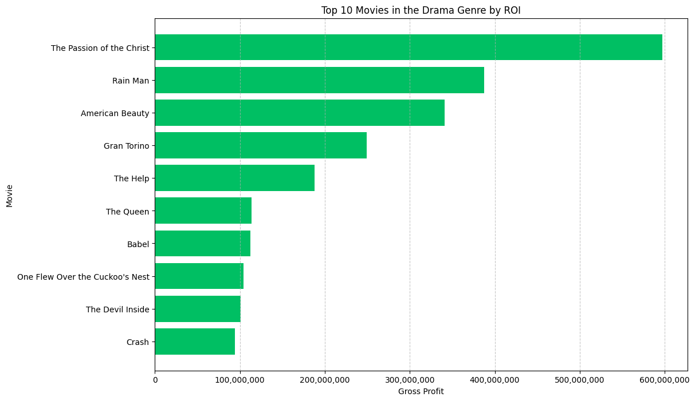

# WAIT, WE CAN MAKE MOVIES!

###  ~ ELIMU KWA WOTE MOVIE STUDIO ~

## Project Overview 
This project will use exploratory data analysis to generate insights for the Movie Director at Elimu Kwa Wote as to how they can start a new movie studio within their organization. 

## Business Problem 

Elimu Kwa Wote(EKW) is a non-profit educational institution whose goal is to educate all people about the word of God. As a start the founders have been spreading this life giving message through songs, community outreach and skits. Recently it was suggested in one of their board meetings that EKW should tap into the movie industry to spread the message of God's love through thrilling , entertaining and mind boggling movies. One of the core values of Elimu Kwa Wote is Lifelong Learning. So it was established that before embarking on the process of creating bible based educational movies, an analysis of the movie industry should be done to establish the main movie genres that most people are watching. With the analyis results,the Elimu Kwa Wote movie committee will be able to pick out themes and stories in the bible that speak of topics and issues that are present in the world today and turn them into soul captivating stories so as to spread the life giving message of God's love to the world enjoyably and memorably.

## Rearch Questions

1. Determine the most popular movie genres. 
 

2. Determine the average runtime for the most popular genre of choice. 
 

3. Identify the top grossing movies among the most popular genre of choice for later further analysis
 

## Results

1. A bar graph showing the most popular genres by vote count. 

##### Source : TMDB

2. A box plot showing the average movie runtime in the drama genre.

##### Source : IMDB

3.  A bar graph showing the top 10 drama movies. 

##### Source : The Numbers DB

## Recommendations
1. FOCUS ON PRODUCING MOVIES IN THE DRAMA GENRE. 
- As Elimu Kwa Wote begins its movie studio, it is recommended that they begin with the production of drama movies due to its large audience.

2. PRODUCE MOVIES WHOSE RUNTIME IS BETWEEN 85 MINUTES AND 105 MINUTES. 
- This is the average rutime for movies in the drama genre. Producing movies withing this range will aid in keeping the audiences attention fixed for the duration of the movie. This will promote the uptake of their movies in the movie industry. 

3. STUDY THE TOP GROSSING DRAMA MOVIES.
- Studying top-grossing movies such as the Passion of Christ, Rain Man , and American beauty to gain insights on the current cinematic techniques as well as the major issues present in the society will help the Elimu Kwa Wote Movie studio to produce movies that will leave a lasting impact on the lives of many people to the Glory of God.

## Next Steps
The following objectives are next in line to be analysed by the Elimu Kwa Wote movie committee. 

- Determine the factors that are taken into consideration when preparing the budget for a successful movie. 

- Determine the marketing strategies used to promote the uptake of top  movies.
